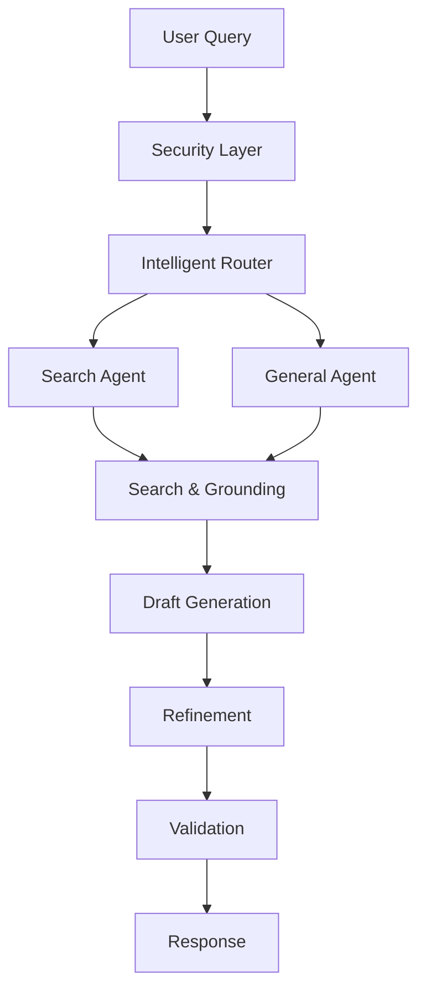

# 🤖 Multi-Agent RAG System

<div align="center">

[](https://www.typescriptlang.org/)
[](https://reactjs.org/)
[](https://vitejs.dev/)
[](https://ai.google.dev/)

_A sophisticated multi-agent retrieval-augmented generation system with intelligent routing, security layers, and real-time visualization_

[View Live Demo](https://ai.studio/apps/drive/19p_px_-OJOzFGj1N9pwWK2idw_dxY5Ik) • [Report Bug](../../issues) • [Request Feature](../../issues)

</div>

## 🌟 Overview

This multi-agent RAG system implements a comprehensive approach to intelligent query processing, featuring automated agent routing, security validation, and real-time processing visualization. The system intelligently determines whether queries require up-to-date search results or can be handled with general knowledge, providing accurate and contextual responses.

### ✨ Key Features

- **🧠 Intelligent Agent Routing**: Automatically routes queries to specialized agents (Search Agent vs General Agent)
- **🔒 Security Layer**: Built-in sanitization with PII detection and prompt injection protection
- **📊 Real-time Visualization**: Interactive architecture diagram showing processing stages
- **🔍 Grounded Search**: Integration with Google Search for up-to-date information
- **✅ Response Validation**: Multi-stage validation with confidence scoring
- **⚡ Rate Limiting**: Built-in rate limiting for API protection
- **🎨 Modern UI**: Clean, responsive interface with professional design

### 🏗️ System Architecture



## 🚀 Quick Start

### Prerequisites

- **Node.js** (v18 or higher)
- **Google AI API Key** ([Get one here](https://ai.google.dev/))

### Installation

1. **Clone the repository**

   ```bash
   git clone https://github.com/rblake2320/multi-agent-RAG-system.git
   cd multi-agent-RAG-system
   ```

2. **Install dependencies**

   ```bash
   npm install
   ```

3. **Configure environment**

   ```bash
   cp .env.local.example .env.local
   # Edit .env.local and add your GEMINI_API_KEY
   ```

4. **Start development server**

   ```bash
   npm run dev
   ```

5. **Open your browser**
   ```
   http://localhost:3000
   ```

## 🔧 Configuration

### Environment Variables

Create a `.env.local` file in the root directory:

```env
GEMINI_API_KEY=your_google_ai_api_key_here
```

### Model Configuration

The system uses Google's Gemini models. You can customize model selection in `services/geminiService.ts`:

```typescript
const ROUTER_MODEL = 'gemini-2.5-flash';
const GENERATION_MODEL_SEARCH = 'gemini-2.5-flash';
const GENERATION_MODEL_GENERAL = 'gemini-2.5-flash';
const VALIDATION_MODEL = 'gemini-2.5-flash';
```

## 📁 Project Structure

```
multi-agent-RAG-system/
├── components/               # React components
│   ├── icons/               # SVG icon components
│   ├── ArchitectureVisualizer.tsx
│   ├── QueryInput.tsx
│   └── ResponseDisplay.tsx
├── services/                # Business logic
│   └── geminiService.ts     # Google AI integration
├── App.tsx                  # Main application component
├── types.ts                 # TypeScript type definitions
├── index.tsx               # Application entry point
├── vite.config.ts          # Vite configuration
└── package.json            # Project dependencies
```

## 🎯 Usage

### Basic Query Processing

1. Enter your query in the input field
2. Watch the real-time processing visualization
3. View the intelligent agent routing decision
4. Receive grounded, validated responses

### Agent Types

- **Search Agent**: Handles queries requiring current information (news, recent events, live data)
- **General Agent**: Handles knowledge-based queries that don't require real-time data

### Security Features

The system automatically:

- Detects and blocks potential PII (emails, phone numbers)
- Prevents prompt injection attacks
- Implements rate limiting
- Validates all responses for accuracy

## 🛠️ Development

### Available Scripts

```bash
npm run dev      # Start development server
npm run build    # Build for production
npm run preview  # Preview production build
```

### Adding New Features

1. **New Components**: Add to `components/` directory
2. **Business Logic**: Extend `services/geminiService.ts`
3. **Types**: Update `types.ts` for TypeScript support
4. **Icons**: Add SVG components to `components/icons/`

## 🚢 Deployment

### Production Build

```bash
npm run build
```

The built files will be in the `dist/` directory, ready for deployment to any static hosting service.

### Environment Setup

Ensure your production environment has:

- `GEMINI_API_KEY` environment variable set
- Node.js 18+ for server-side rendering (if needed)

## 🤝 Contributing

1. Fork the repository
2. Create a feature branch (`git checkout -b feature/amazing-feature`)
3. Commit your changes (`git commit -m 'Add amazing feature'`)
4. Push to the branch (`git push origin feature/amazing-feature`)
5. Open a Pull Request

## 📄 License

This project is licensed under the MIT License - see the [LICENSE](LICENSE) file for details.

## 🙏 Acknowledgments

- [Google AI](https://ai.google.dev/) for the Gemini API
- [React](https://reactjs.org/) for the UI framework
- [Vite](https://vitejs.dev/) for the build tool
- [TypeScript](https://www.typescriptlang.org/) for type safety

---

<div align="center">
Made with ❤️ for intelligent query processing
</div>
